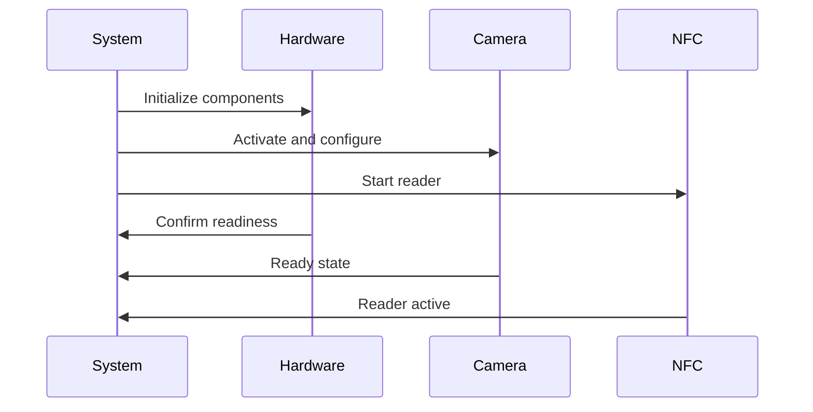
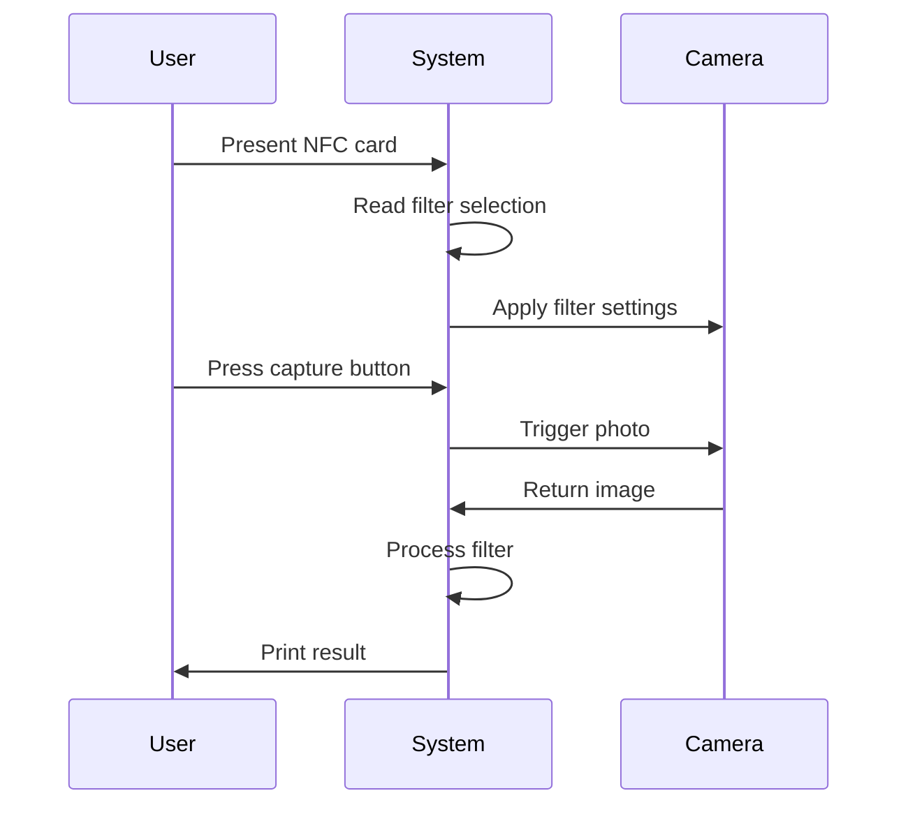

# RetroBooth Documentation
> A retro photo booth with NFC filter selection

## Table of Contents
1. [Quick Start](#quick-start)
2. [Overview](#overview)
3. [Team and Contributors](#team-and-contributors)
4. [System Architecture](#system-architecture)
5. [Implementation Guide](#implementation-guide)
6. [Troubleshooting](#troubleshooting)
7. [Future Development](#future-development)

# Gallery



## Quick Start
- **Repository**: [GitHub - RetroBooth](https://github.com/HackerspaceVLC/retrobooth)
- **Current Status**: Project completed, in documentation phase
- **Key Feature**: NFC-based filter selection with Polaroid-style reveal
- **Privacy**: Photos automatically deleted after printing

## Overview
RetroBooth modernizes the classic photo booth experience by combining vintage aesthetics with contemporary technology. Users select filters using physical NFC cards, creating an interactive and tactile experience. Following the Polaroid philosophy, photos remain hidden until printing, adding an element of anticipation and surprise.

## Team and Contributors

### Hardware Team
- **Javier Donate**
  - Role: Hardware Design Lead
  - Responsibilities: System architecture and hardware implementation

- **José Gil (Genio del Mal)**
  - Role: Integration Specialist
  - Responsibilities: Component assembly and system integration

### Software Team
- **Ignacio Delgado**
  - Role: Software Development Lead
  - Website: [ignaciodelgado.com](https://ignaciodelgado.com)
  - Responsibilities: Software architecture and control systems

## System Architecture

### Hardware Components
#### Core Processing
- Raspberry Pi (3B+ or higher)
- Raspberry Pi-compatible camera module
- NFC reader (MIFARE Classic compatible)
- Industrial-grade capture button
- Integrated LED lighting system
- Stabilized power supply

#### Physical Structure
- Retro-inspired booth design
- Public-use grade materials
- Maintenance access panels
- Integrated component housing

### Software Stack
#### Operating System
- Raspberry Pi OS (latest stable release)
- Python 3.7+ runtime environment

#### Core Libraries
- `RPi.GPIO`: Hardware control interface
- `MFRC522-python`: NFC communication
- `Pillow`: Image processing and filters

#### Key Features
- Real-time filter processing
- Temporary local storage
- Privacy-focused photo management
- NFC card detection and mapping

## Implementation Guide

### System Initialization Flow

### User Interaction Flow

## Troubleshooting

### NFC System Issues
| Problem | Solution |
|---------|----------|
| No card detection | Check reader power supply |
| Intermittent reads | Verify cable connections |
| System freeze | Perform full system restart |

### Camera Problems
| Issue | Resolution |
|-------|------------|
| No preview | Check physical connections |
| Poor image quality | Verify lighting system |
| System crash | Restart camera module |

## Future Development

### Hardware Enhancements
- Touch screen integration
- Advanced lighting system
- Improved print quality

### Software Features
- Web-based administration
- Custom filter creation
- Email delivery system
- Usage analytics dashboard

## References
1. [Raspberry Pi Official Documentation](https://www.raspberrypi.org/documentation/)
2. [MFRC522 Technical Specifications](https://www.nxp.com/docs/en/data-sheet/MFRC522.pdf)
3. [Python Development Guidelines](https://www.python.org/dev/peps/)
