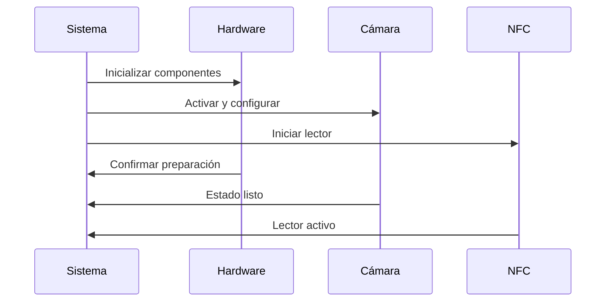
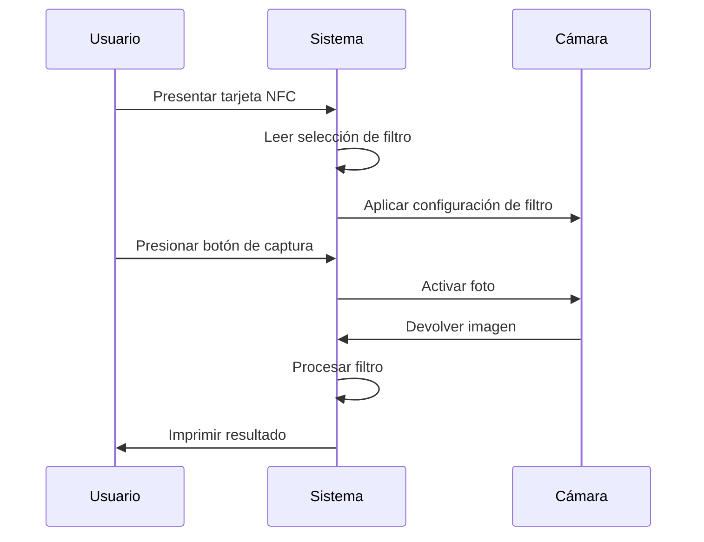

# Documentación RetroBooth
> Un fotomatón retro con selección de filtros mediante NFC

## Índice
1. [Inicio Rápido](#inicio-rápido)
2. [Descripción General](#descripción-general)
3. [Equipo y Colaboradores](#equipo-y-colaboradores)
4. [Arquitectura del Sistema](#arquitectura-del-sistema)
5. [Guía de Implementación](#guía-de-implementación)
6. [Solución de Problemas](#solución-de-problemas)
7. [Desarrollo Futuro](#desarrollo-futuro)

# Galería



## Inicio Rápido
- **Repositorio**: [GitHub - RetroBooth](https://github.com/HackerspaceVLC/retrobooth)
- **Estado Actual**: Proyecto completado, en fase de documentación
- **Característica Principal**: Selección de filtros mediante NFC con revelado estilo Polaroid
- **Privacidad**: Las fotos se eliminan automáticamente después de la impresión

## Descripción General
RetroBooth moderniza la experiencia clásica del fotomatón combinando la estética vintage con tecnología contemporánea. Los usuarios seleccionan filtros usando tarjetas NFC físicas, creando una experiencia interactiva y táctil. Siguiendo la filosofía Polaroid, las fotos permanecen ocultas hasta su impresión, añadiendo un elemento de anticipación y sorpresa.

## Equipo y Colaboradores

### Equipo de Hardware
- **Javier Donate**
  - Rol: Líder de Diseño de Hardware
  - Responsabilidades: Arquitectura del sistema e implementación de hardware

- **José Gil (Genio del Mal)**
  - Rol: Especialista en Integración
  - Responsabilidades: Ensamblaje de componentes e integración del sistema

### Equipo de Software
- **Ignacio Delgado**
  - Rol: Líder de Desarrollo de Software
  - Web: [ignaciodelgado.com](https://ignaciodelgado.com)
  - Responsabilidades: Arquitectura de software y sistemas de control

## Arquitectura del Sistema

### Componentes de Hardware
#### Procesamiento Central
- Raspberry Pi (3B+ o superior)
- Módulo de cámara compatible con Raspberry Pi
- Lector NFC (compatible con MIFARE Classic)
- Botón de captura de grado industrial
- Sistema de iluminación LED integrado
- Fuente de alimentación estabilizada

#### Estructura Física
- Diseño inspirado en fotomatones retro
- Materiales aptos para uso público
- Paneles de acceso para mantenimiento
- Alojamiento integrado de componentes

### Stack de Software
#### Sistema Operativo
- Raspberry Pi OS (última versión estable)
- Entorno de ejecución Python 3.7+

#### Bibliotecas Principales
- `RPi.GPIO`: Interfaz de control de hardware
- `MFRC522-python`: Comunicación NFC
- `Pillow`: Procesamiento de imágenes y filtros

#### Características Principales
- Procesamiento de filtros en tiempo real
- Almacenamiento local temporal
- Gestión de fotos enfocada en privacidad
- Detección y mapeo de tarjetas NFC

## Guía de Implementación

### Flujo de Inicialización del Sistema

### Flujo de Interacción del Usuario

## Solución de Problemas

### Problemas del Sistema NFC
| Problema | Solución |
|----------|----------|
| No detecta tarjetas | Revisar alimentación del lector |
| Lecturas intermitentes | Verificar conexiones de cables |
| Sistema bloqueado | Realizar reinicio completo |

### Problemas de Cámara
| Problema | Solución |
|----------|-----------|
| Sin vista previa | Revisar conexiones físicas |
| Mala calidad de imagen | Verificar sistema de iluminación |
| Bloqueo del sistema | Reiniciar módulo de cámara |

## Desarrollo Futuro

### Mejoras de Hardware
- Integración de pantalla táctil
- Sistema de iluminación avanzado
- Mejora de calidad de impresión

### Características de Software
- Administración basada en web
- Creación de filtros personalizados
- Sistema de envío por correo electrónico
- Panel de análisis de uso

## Referencias
1. [Documentación Oficial de Raspberry Pi](https://www.raspberrypi.org/documentation/)
2. [Especificaciones Técnicas MFRC522](https://www.nxp.com/docs/en/data-sheet/MFRC522.pdf)
3. [Guías de Desarrollo Python](https://www.python.org/dev/peps/)
